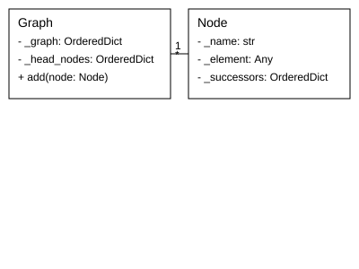

**Diagram Documentation for ********`Graph`******** and ********`Node`******** Classes**

### Overview

This document provides a set of diagrams to help understand the structure and operation of the `Graph` and `Node` classes. These diagrams cover:

1. **Class Relationships** - Depicts the relationships and properties of the `Graph` and `Node` classes.
2. **Example Usage Flow** - Illustrates a step-by-step process of using the `Graph` and `Node` classes based on the provided usage example.
3. **Graph Traversal** - Demonstrates how the `traverse` function operates on a structured graph definition.

---

### 1. Class Relationships

#### UML Diagram:


---

### 2. Example Usage Flow

#### Code:
```python
from aiko_services.main.utilities import *
graph = Graph()
node_a = Node("a")
node_b = Node("b")
node_a.add("b")
graph.add(node_a)
graph.add(node_b)
print(graph.nodes())
```

#### Flow Diagram:


---

### 3. Graph Traversal

#### Example Definition:
```python
heads, successors = graph.traverse([
  "(a (b d) (c d))"
])
```

#### Traversal Process:
1. Parse the string `"(a (b d) (c d))"` into a tree-like structure.
2. Identify `a` as the head node.
3. Add `b` and `c` as successors to `a`.
4. Add `d` as successors to both `b` and `c`.

#### Diagram:


#### Data Structure:
- **Heads**: `{ "a": Node("a") }`
- **Successors**:
  ```python
  {
    "a": {"b": "b", "c": "c"},
    "b": {"d": "d"},
    "c": {"d": "d"}
  }
  ```

---

These diagrams and explanations should help in visualizing the functionality and relationships within the `Graph` and `Node` classes.

