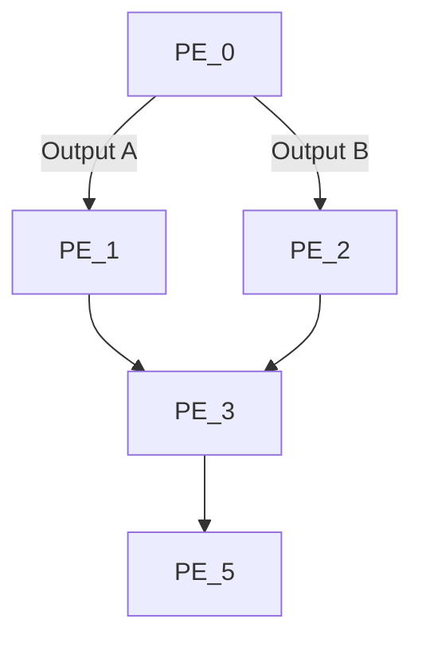
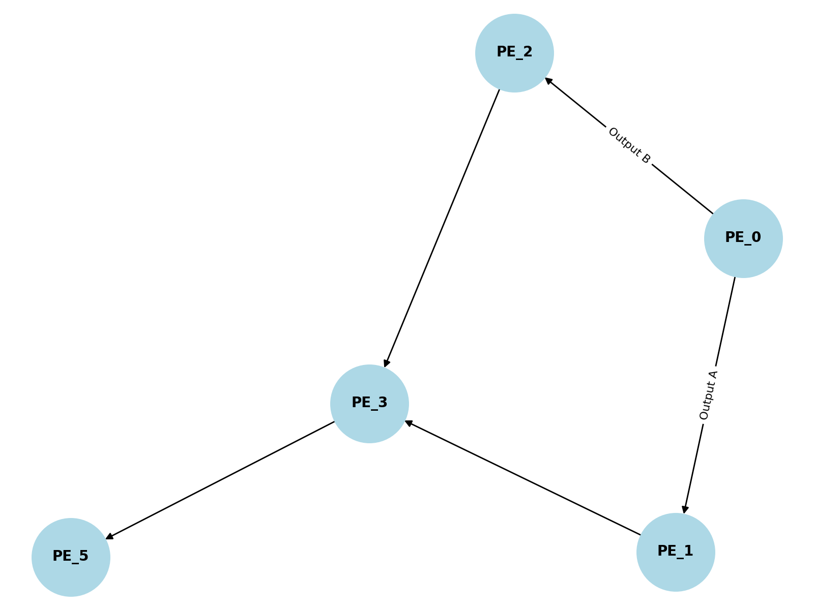

# Pipeline Management Documentation

## Overview
This documentation provides a comprehensive understanding of the `aiko_pipeline` management script, which facilitates creating, managing, and destroying pipelines consisting of pipeline elements (actors or services).

## Usage

### Command Line Interface (CLI)

#### Creating a Pipeline
```bash
aiko_pipeline create [--name $PIPELINE_NAME] $DEFINITION
```
Example:
```bash
aiko_pipeline create pipeline_definition.json --log_level debug --stream_id 1 --frame_data "(argument_name: argument_value ...)"
```

#### Destroying a Pipeline
```bash
aiko_pipeline destroy $PIPELINE_NAME
```

### MQTT Integration
Use MQTT to interact with pipelines dynamically.

**Create Stream:**
```bash
mosquitto_pub -h $HOST -t $TOPIC -m "(create_stream 1)"
```

**Process Frame:**
```bash
mosquitto_pub -h $HOST -t $TOPIC -m "(process_frame (stream_id: 1) (a: 0))"
```

**Destroy Stream:**
```bash
mosquitto_pub -h $HOST -t $TOPIC -m "(destroy_stream 1)"
```

### Pipeline Definition
A pipeline definition specifies the graph of pipeline elements. Example definitions:

**Simple Graph:**
```json
"graph": [
  "(PE_0 PE_1)"
]
```

**Complex Graph:**
```json
"graph": [
  "(PE_0 (PE_1 (PE_3 PE_5)) (PE_2 (PE_4 PE_5)))"
]
```

**Mapping Function Arguments:**
```json
"graph": [
  "(PE_0 (PE_1 PE_3 (a: x)) (PE_2 PE_3 (b: y)))"
]
```

## Key Concepts

### Relationship to Actors
Pipelines and PipelineElements in the `aiko_pipeline` framework are closely tied to the concept of **Actors**, which represent independent entities capable of processing data and interacting with other actors via defined protocols.

- **Pipeline as an Actor:**
  The `Pipeline` class is derived from the Actor abstraction, making it a first-class entity that interacts with other actors in the system. It manages the lifecycle of streams and coordinates the execution of PipelineElements.

- **PipelineElement as an Actor:**
  Each `PipelineElement` is an independent actor that processes data frames and communicates with other elements. By adhering to the Actor interface, PipelineElements can function either locally or as remote services, leveraging Actor discovery and messaging protocols.

### Integration with Actor System
- **Protocols:** Pipelines and elements utilize predefined protocols (e.g., `PROTOCOL_PIPELINE`) for communication.
- **Discovery:** Remote elements are dynamically discovered and proxied using the Actor discovery mechanism.
- **Lifecycle Management:** Actors manage their own lifecycle states, such as `ready` or `absent`, enabling robust and dynamic pipeline configurations.


### Pipeline Elements
A `PipelineElement` represents an actor or service within the pipeline. Each element has inputs, outputs, and parameters.

### Deployment Types
Pipeline elements can be deployed:
- **Locally:** Using a specific Python class and module.
- **Remotely:** By specifying a service filter for discovery.

### Stream Management
Streams manage data flow through the pipeline. Operations include:
- **create_stream()**: Initializes a stream.
- **process_frame()**: Processes a data frame.
- **destroy_stream()**: Cleans up the stream.

## Pipeline Class
The `Pipeline` class is the core abstraction for managing pipelines. It provides methods to:
- Create and destroy streams.
- Process frames and handle stream states.
- Parse pipeline definitions from JSON files and validate them.

#### Key Methods
- `create_stream()`: Initializes a new stream for data processing.
- `destroy_stream()`: Terminates an existing stream and releases resources.
- `process_frame()`: Processes an individual frame of data in the pipeline.
- `parse_pipeline_definition()`: Parses and validates a pipeline definition file.

The `PipelineImpl` class is the concrete implementation that handles the underlying operations, including:
- Managing graph-based relationships between pipeline elements.
- Handling both local and remote deployment scenarios.
- Interacting with MQTT for dynamic pipeline management.

## PipelineElement Class
The `PipelineElement` class represents the individual actors or services within the pipeline. It is an abstract base class defining the following methods:
- `process_frame()`: Processes a data frame received from a stream.
- `start_stream()`: Starts a new stream for the element.
- `stop_stream()`: Stops a stream managed by the element.
- `get_parameter()`: Retrieves a configuration parameter for the element.

#### Implementation
The `PipelineElementImpl` class provides a concrete implementation with features such as:
- Dynamic parameter management and logging.
- Support for distributed processing and frame creation.
- Integration with both local and remote pipelines.

### Deployment Scenarios
- **Local Elements:** Defined by a Python class and module. Ideal for tightly coupled operations.
- **Remote Elements:** Use MQTT for discovery and communication, enabling distributed pipeline setups.

## CLI Options

### `create` Command Options
| Option              | Description                                      |
|---------------------|--------------------------------------------------|
| `--name`            | Name of the pipeline.                           |
| `--graph_path`      | Specify the graph path for the pipeline.         |
| `--parameters`      | Define stream parameters.                        |
| `--stream_id`       | Identifier for the stream.                       |
| `--frame_id`        | Identifier for the frame.                        |
| `--frame_data`      | Data to process in the frame.                    |
| `--log_level`       | Logging level (e.g., debug, info).               |
| `--windows`         | Enable sliding window protocol.                  |
| `--exit_message`    | Display a message upon pipeline exit.            |

### `destroy` Command Options
| Option              | Description                                      |
|---------------------|--------------------------------------------------|
| `name`              | Name of the pipeline to destroy.                |

## Internal Components

### PipelineGraph Class
The `PipelineGraph` class is responsible for managing the relationships between pipeline elements in a directed graph structure. It encapsulates the logic for adding elements, validating inputs, and traversing the graph.

#### Key Methods
- `__init__(head_nodes=None)`: Initializes the graph with optional head nodes.
  - **Parameters:**
    - `head_nodes`: A list of nodes that serve as entry points to the graph.
  - **Description:** Sets up the internal graph representation and prepares it for pipeline operations.

- `add_element(element)`: Adds a pipeline element to the graph.
  - **Parameters:**
    - `element`: The pipeline element to be added.
  - **Description:** Integrates the element into the graph and initializes its predecessors as an empty `OrderedDict`.

- `element_count`: Returns the total number of elements in the graph.
  - **Description:** A property that calculates the size of the graph dynamically.

- `get_element(node)`: Retrieves information about a specific node in the graph.
  - **Parameters:**
    - `node`: The graph node to inspect.
  - **Returns:**
    - `element`: The pipeline element associated with the node.
    - `name`: The name of the element.
    - `local`: Boolean indicating if the element is local.
    - `lifecycle`: The lifecycle state of the element.
  - **Description:** Provides details about the pipeline element, including its type and lifecycle status.

- `validate_inputs(inputs, predecessors, checked=None, strict=False)`: Validates the inputs to a pipeline element.
  - **Parameters:**
    - `inputs`: List of expected inputs for the element.
    - `predecessors`: Predecessor nodes in the graph.
    - `checked`: A list of already validated predecessors.
    - `strict`: Whether to enforce strict validation.
  - **Returns:**
    - Updated `inputs` and `checked` lists.
  - **Description:** Ensures that all inputs are correctly provided by predecessors.

- `validate_mapping(map_in_nodes, element_name, input)`: Validates input-output mappings for a pipeline element.
  - **Parameters:**
    - `map_in_nodes`: Mapping definitions for input nodes.
    - `element_name`: The name of the element being validated.
    - `input`: The input to validate.
  - **Returns:**
    - A list of valid mappings.
  - **Description:** Checks if the input mappings are consistent with the graph definition.

- `validate(pipeline_definition, head_node_name, strict=False)`: Validates the entire pipeline graph against its definition.
  - **Parameters:**
    - `pipeline_definition`: The pipeline definition to validate against.
    - `head_node_name`: The starting node of the validation process.
    - `strict`: Whether to enforce strict validation rules.
  - **Description:** Ensures the graph adheres to its definition and that all elements are connected and correctly configured.

- `get_path(head_node_name)`: Retrieves the path of nodes starting from a specific head node.
  - **Parameters:**
    - `head_node_name`: The name of the head node.
  - **Returns:**
    - A list of nodes forming the path.
  - **Description:** Useful for traversing the graph and analyzing its structure.

- `iterate_after(node_name, graph_path)`: Iterates over the graph nodes after a specified node.
  - **Parameters:**
    - `node_name`: The node to start iterating from.
    - `graph_path`: The path to iterate along.
  - **Description:** Facilitates partial traversal of the graph.


### Pipeline Classes
- **Pipeline:** Base class for managing pipeline operations.
- **PipelineImpl:** Concrete implementation with dynamic graph management.
- **PipelineElement:** Represents an individual actor or service.
- **PipelineElementImpl:** Concrete implementation for processing and managing streams.

### Validation
Pipeline definitions are validated against an Avro schema to ensure correctness.

## To-Do
- Add CLI commands for showing and setting parameters.
- Enhance support for remote elements and dynamic proxies.

## Example Diagram
Below is a visual representation of a sample pipeline graph.

### Pipeline Graph
The diagram represents a hierarchical structure where nodes are pipeline elements, and edges denote data flow.



## Resources
- [Avro Specification](https://avro.apache.org/docs/1.9.1/spec.html)
- Python libraries for handling Avro:
  - [python-avro-json-serializer](https://github.com/linkedin/python-avro-json-serializer)
  - [python-schema-registry-client](https://marcosschroh.github.io/python-schema-registry-client)

## Diagram Embed
The following PNG images visually represent the system:

### Sample Pipeline Graph:


### Class Relationships:


## Conclusion
This documentation and the accompanying diagrams provide a foundation for understanding and managing the `aiko_pipeline` system. For more advanced usage, refer to the source code and resources listed above.

