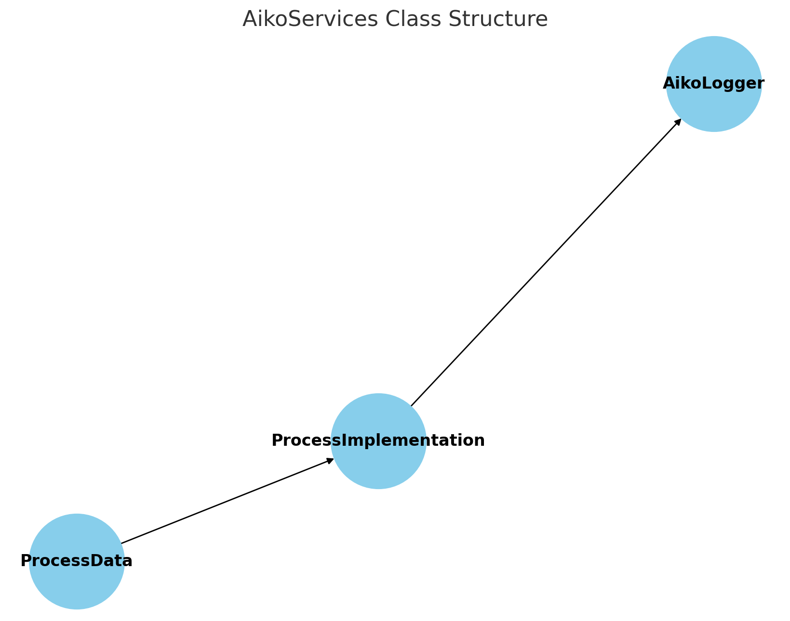
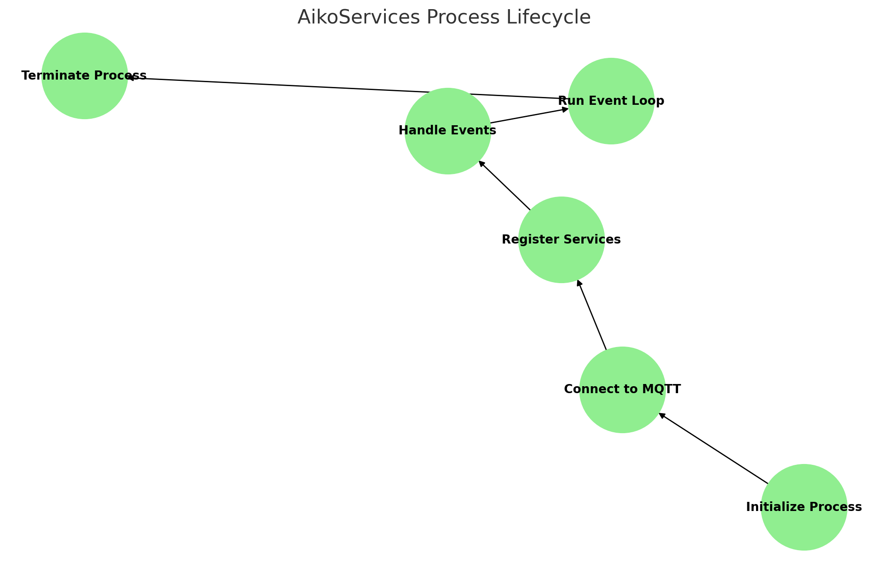

# Developer Documentation for AikoServices Framework

## Overview

AikoServices is a framework designed to support applications that require one or many services within a single process. It provides robust service registration, event handling, and logging capabilities for processes, including MQTT integration and lifecycle management.

### Key Features

- **Support for Multiple Services**: Allows management of one or more services within a single process.
- **Lifecycle Management**: Includes lifecycle management for services.
- **MQTT Integration**: Provides logging and messaging capabilities via MQTT.
- **Event Handling**: Supports event-driven programming with message and timer handlers.
- **Service Registration**: Manages service registration with local or remote registrars.

---

## Usage

```python
from aiko_services.main import *  # Invokes __init__.py

def timer_handler():
    print("timer_handler()")

aiko.process = process_create()  # Invoked from __init__.py
event.add_timer_handler(timer_handler, 1.0)
aiko.process.run()  # Invoked by application code
```

---

## Class Diagram

Below is a visual representation of the class structure and relationships in the AikoServices framework:



---

## Modules and Classes

### 1. **`ProcessData`**
A singleton class for storing process-wide data, including topics, MQTT connections, and the registrar.

- **Attributes**:
  - `connection`: Manages MQTT connections.
  - `logger`: Logging instance for services.
  - `registrar`: Holds registrar information.
  - `topic_path_process`: Base topic path for the process.
  - `payload_lwt`: Last Will and Testament payload.

- **Methods**:
  - `get_topic_path(service_id)`: Generates topic paths for services.

---

### 2. **`AikoLogger`**
Provides logging functionality for the process and individual services. Supports MQTT-based logging.

- **Methods**:
  - `logger(name, log_level=None, logging_handler=None, topic=aiko.topic_log)`: Creates a logger instance.

---

### 3. **`ProcessImplementation`**
Implements the core logic of the process, including event handling, service management, and MQTT integration.

- **Attributes**:
  - `initialized`: Indicates if the process is initialized.
  - `running`: Tracks if the process is currently running.
  - `_services`: Dictionary of registered services.

- **Methods**:
  - `initialize(mqtt_connection_required=True)`: Initializes the process, sets up MQTT connections, and event handlers.
  - `run(loop_when_no_handlers=False)`: Starts the process and enters the event loop.
  - `add_service(service)`: Adds a service to the process.
  - `remove_service(service_id)`: Removes a service from the process.
  - `terminate(exit_status=0)`: Terminates the process.

---

## Key Functionalities

### Service Registration

Services can be added and removed dynamically. The registrar maintains the service registry, ensuring all services are accessible and well-defined.

#### Adding a Service
```python
def add_service(self, service):
    self.service_count += 1
    service.service_id = self.service_count
    service.topic_path = aiko.get_topic_path(service.service_id)
    self._services[service.service_id] = service
```

#### Removing a Service
```python
def remove_service(self, service_id):
    if service_id in self._services:
        del self._services[service_id]
        self.service_count -= 1
```

### Event Handling
The framework uses a centralized event system to manage message queues and timers. Message handlers can be added or removed dynamically.

---

### Registrar

The `registrar` is a core component responsible for managing service registration and coordination. It provides the following functionalities:

1. **Service Registration**:
   - Maintains a registry of active services, ensuring discoverability and accessibility.
   - When a service is added, the registrar updates its registry with the service’s metadata, such as name, topic path, owner, and protocol.

   Example:
   ```python
   payload_out = f"(add {service.topic_path} {service.name} {service.protocol} {service.transport} {owner} ({tags}))"
   registrar_topic_in = f"{aiko.registrar['topic_path']}/in"
   aiko.message.publish(registrar_topic_in, payload_out)
   ```

2. **Service Deregistration**:
   - Removes inactive or terminated services from the registry to avoid stale entries.

   Example:
   ```python
   payload_out = f"(remove {service.topic_path})"
   registrar_topic_in = f"{aiko.registrar['topic_path']}/in"
   aiko.message.publish(registrar_topic_in, payload_out)
   ```

3. **Communication Facilitation**:
   - Acts as a central hub for communication among services by maintaining a consistent registry.

4. **Registrar Absence Handling**:
   - Handles scenarios where the registrar is absent or unavailable. For instance, the framework can terminate the process or attempt reconnection based on configuration.

5. **Metadata Management**:
   - Tracks registrar metadata such as `topic_path`, version, and timestamp to ensure efficient interaction.

   Example absence handling:
   ```python
   if action == "absent":
       aiko.registrar = None
       aiko.connection.update_state(ConnectionState.TRANSPORT)
       if self._registrar_absent_terminate:
           self.terminate(1)
   ```

The registrar ensures reliable service discovery, coordination, and scalability within the system.

---

## To Do

- **Bug Fixes**:
  - Resolve incorrect `Service Id` usage in `AikoLogger.logger()`.
- **Enhancements**:
  - Improve logging accuracy with `ContextManager`.
  - Add support for multiple message server connections.
  - Optimize registrar-related functions.
- **Testing**:
  - Perform load testing for scalability.

---

## Example Diagram

A high-level view of the process lifecycle:



---

## Future Improvements

- Replace global event functions with handler class instances.
- Enhance MQTT reconnection logic for improved reliability.
- Integrate with external monitoring tools like Grafana and InfluxDB for statistics.

---

## Load Testing Goals

- **Single Process**:
  - 1,000+ Services.
  - 10,000+ Services.
- **Distributed Processes**:
  - 1,000+ Processes each with 1,000+ Services.
  - 10,000+ Processes each with 10,000+ Services.

---

This documentation provides a detailed overview of the AikoServices framework, outlining its architecture, usage, and areas for future development. For further assistance, consult the module’s source code or contact the development team.

