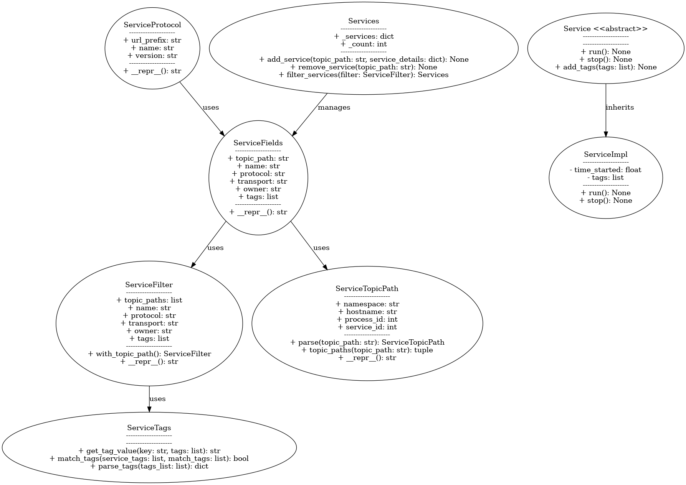

# SERVICE.py Documentation

## Overview
This module defines a distributed component that can be discovered and processes messages. It defines a `Service` that runs within a `Process`. It provides abstractions and utility classes for managing service protocols, filtering, tags, and topic paths. Below is an in-depth documentation with class diagrams for better understanding.

## Key Classes
### 1. `ServiceProtocol`
Represents a protocol used by the services.
- **Attributes**:
  - `url_prefix`: URL prefix of the protocol.
  - `name`: Name of the protocol.
  - `version`: Version of the protocol.
- **Methods**:
  - Getters and setters for attributes.
  - `__repr__`: String representation of the protocol.

### 2. `ServiceFields`
Encapsulates the details of a service.
- **Attributes**:
  - `topic_path`: Path identifying the service.
  - `name`: Name of the service.
  - `protocol`: Protocol of the service.
  - `transport`: Transport mechanism used by the service.
  - `owner`: Owner of the service.
  - `tags`: Tags associated with the service.
- **Methods**:
  - Getters and setters for all attributes.
  - `__repr__`: String representation of service fields.

### 3. `ServiceFilter`
Filters services based on criteria.
- **Attributes**:
  - `topic_paths`, `name`, `protocol`, `transport`, `owner`, `tags`: Filter criteria.
- **Methods**:
  - `with_topic_path`: Creates a filter with topic paths.
  - `__repr__`: String representation of the filter.

### 4. `ServiceTags`
Utility class for managing service tags.
- **Methods**:
  - `get_tag_value`: Retrieves the value of a specific tag.
  - `match_tags`: Matches a set of tags with service tags.
  - `parse_tags`: Parses tags from a list.

### 5. `ServiceTopicPath`
Represents and manages topic paths of services.
- **Attributes**:
  - `namespace`, `hostname`, `process_id`, `service_id`: Components of the topic path.
- **Methods**:
  - `parse`: Parses a topic path string.
  - `topic_paths`: Retrieves topic paths for processes.
  - Getters and setters for attributes.
  - `__repr__`: String representation of the topic path.

### 6. `Services`
Manages a collection of services.
- **Attributes**:
  - `_services`: Dictionary of services.
  - `_count`: Count of services.
- **Methods**:
  - Add, remove, filter services.
  - Retrieve services by topic path or attributes.

### 7. `Service`
Abstract base class for a service.
- **Methods**:
  - `add_message_handler`, `remove_message_handler`: Manage message handlers.
  - `registrar_handler_call`: Handle registrar actions.
  - `run`: Run the service.
  - `stop`: Stop the service.
  - Tag management methods.

### 8. `ServiceImpl`
Concrete implementation of `Service`.
- **Attributes**:
  - `time_started`, `name`, `protocol`, `tags`, `transport`: Service properties.
  - Topics for communication.
- **Methods**:
  - Implements all abstract methods from `Service`.

## Class Diagram

## Notes and Future Enhancements
- **BUG**: Provide filtered services to `service_change_handler`.
- Consider using `@dataclass` for simplification.
- Ensure services are properly added to and removed from the registrar.
- Enhance service protocol definitions and documentation.
- Extend `ServiceFields` for better parsing, validation, and representation.

This documentation provides an overview of the code structure and details for key classes. The class diagram offers a visual representation to understand relationships between components.

